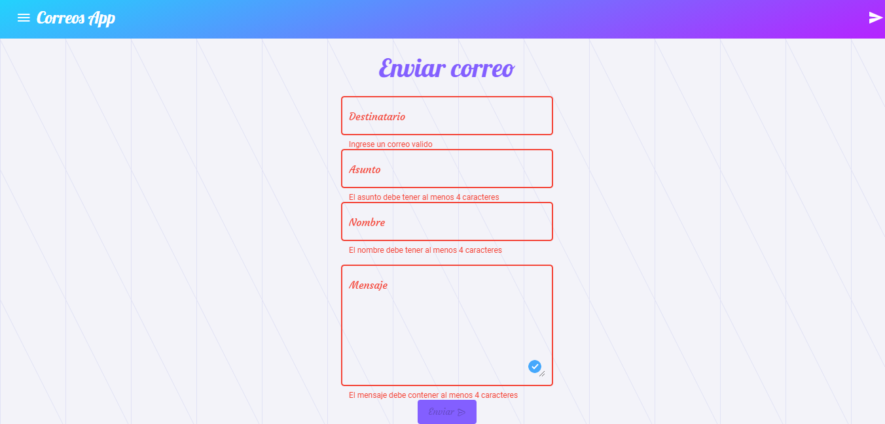

# Frontend Correos App

## Descripción
Integración del frontend para realizar el envió de correos electrónicos mediante una interfaz gráfica utilizando una aplicación web, así mismo los correos enviados son guardados en una base de datos para posteriormente mostrar al usuario final los correos enviados.

## Tecnologías utilizadas
1. Angular 
2. Angular Material
3. Ngx Pagination
4. Backend Correos App - https://github.com/edflor46/BackendCorreos-Node-Express-MongoDB

## Características
1. Envió de correos
2. Mostrar correos enviados
3. Información detallada del correo seleccionado
4. Validaciones con formularios reactivos
5. Paginación de datos

## Secciones
1. Enviar mail
2. Mail enviado
3. Acerca de

## Capturas

### Inicio

### Formulario de envió

### Validaciones

### Formulario correcto

### Notificación de correo enviado

### Registro de envíos

### Detalles del correo

### Correo recibido en gmail

### Acerca de la aplicación web

### Sin registros de correos

## Demo 
https://mail-app-send.herokuapp.com/

